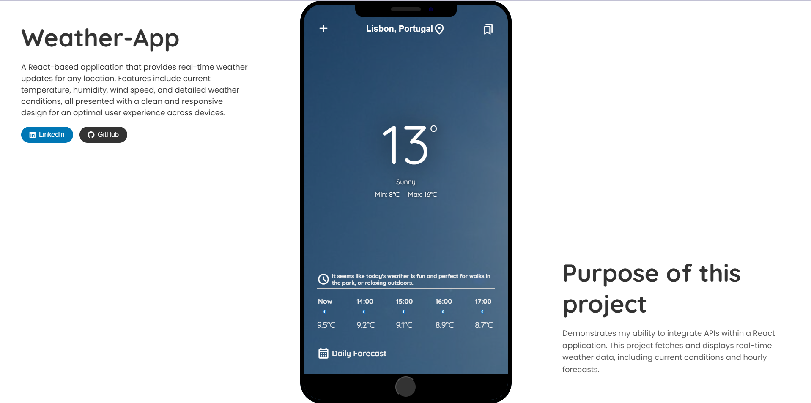

# WeatherApp



## Description

**WeatherApp** is a web application developed with React that simulates a smartphone interface to display weather information. This project demonstrates the use of various APIs to provide real-time data on weather, location, and country information. Due to API restrictions, some data may be limited. Additionally, to ensure proper location functionality, it is necessary to disable ad blockers.

## Features

- **Current Weather Forecast**: Displays the current weather conditions for a specific city.
- **City Suggestions**: Provides city suggestions as the user types.
- **Extended Forecast**: Shows a 7-day weather forecast, including hourly data.
- **IP-Based Location**: Automatically detects the user's location based on their IP address.
- **Country Information**: Displays detailed information about the country of the current location.
- 
## 🌐 Live Demo

- **Website:** [Storytime Live](https://sramoras.github.io/weatherapp/)
- 
## Technologies Used


### APIs Used

- [](https://www.weatherapi.com/)
- [](https://ipinfo.io/)
- [](https://restcountries.com/)

## Installation

### 1. Clone the Repository

```bash
git clone https://github.com/SRamoras/weatherapp.git
cd weatherapp
```

### 2. Install Dependencies

```bash
npm install
```

### 3. Configure Environment Variables
Create a .env file in the root of the project and add the following variables:
```bash
VITE_OPENWEATHER_API_KEY=YOUR_WEATHERAPI_KEY
VITE_IPINFO_TOKEN=YOUR_IPINFO_TOKEN
```
- **VITE_OPENWEATHER_API_KEY**: API key from WeatherAPI.
- **VITE_IPINFO_TOKEN**: Access token from ipinfo.io.

### 4. Start the Application
```bash
npm run dev
```

## 📄 License

This project is licensed under the [MIT License](./LICENSE).

## 📫 Contact

For more information, feel free to reach out:

- **LinkedIn:** [Diogo Silva](https://www.linkedin.com/in/diogo-silva-94068613b/)
- **GitHub:** [SRamoras](https://github.com/SRamoras)

---
